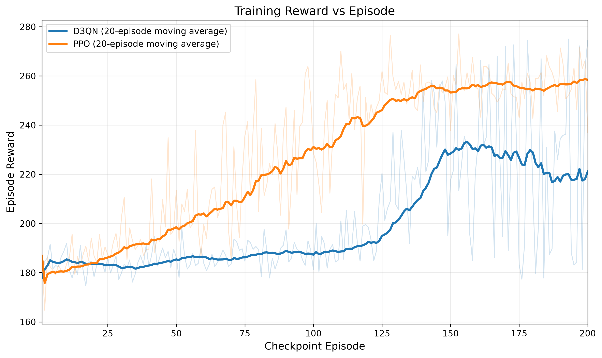
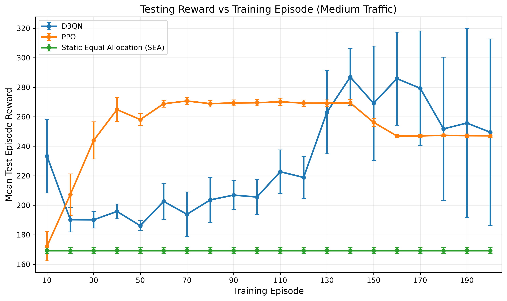
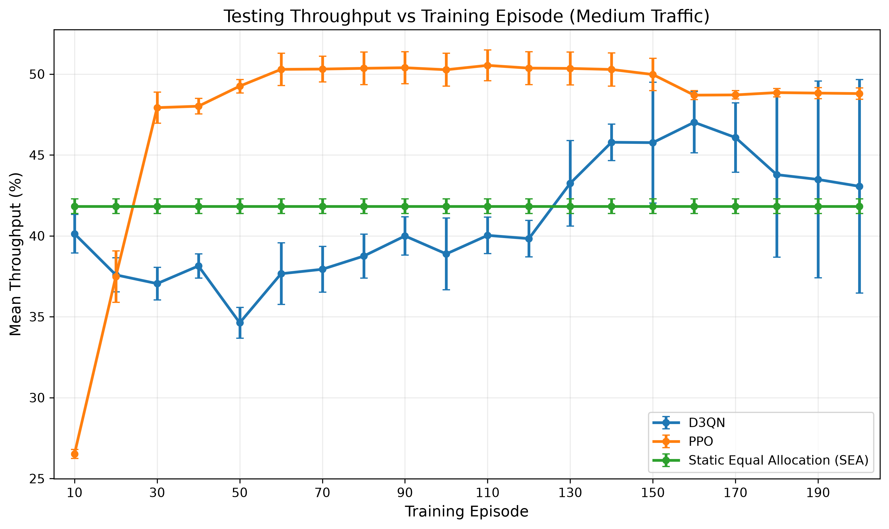
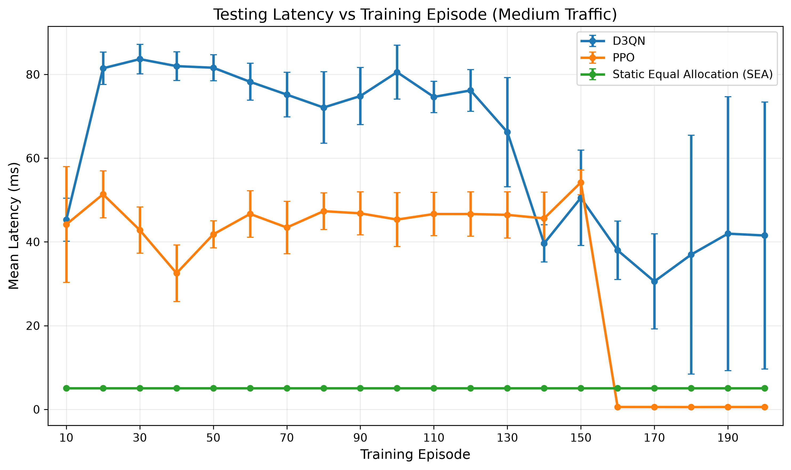
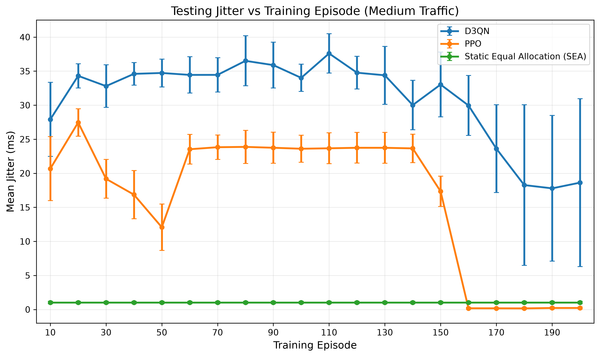
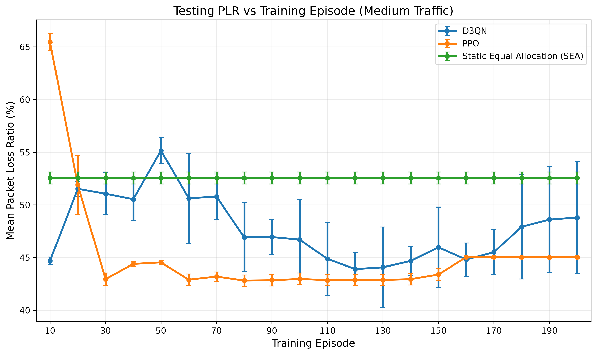

# DRL-Assisted Dynamic Network Slicing Management in Beyond 5G/6G Networks

## Project Overview

This project investigates **Deep Reinforcement Learning (DRL)-assisted dynamic resource allocation** for network slicing in Beyond 5G (B5G) / 6G networks.

The objective is to dynamically redistribute a fixed pool of **100 Resource Blocks (RBs)** among four network slices according to changing traffic conditions and Quality of Service (QoS) requirements.

The proposed method is a **Double Dueling Deep Q-Network (D3QN)**. Its performance is compared with:

- **Proximal Policy Optimization (PPO)** — DRL comparison method
- **Static Equal Allocation (SEA)** — conventional non-learning baseline

All three methods are evaluated under a common simulation setup so that the state representation, action space, traffic model, channel model, reward logic, resource budget and evaluation conditions remain consistent.

---

## Network Slices

The environment contains four slices:

| Slice | General Role |
|---|---|
| `eMBB` | Enhanced Mobile Broadband / high-data-rate traffic |
| `URLLC1` | Low-latency and reliability-sensitive traffic |
| `URLLC2` | Periodic URLLC-style traffic |
| `BE1` | Best-effort traffic |

Total available resources:

```text
TOTAL_RB = 100
```

---

## Common Simulation Setup

| Parameter | Value |
|---|---:|
| Number of slices | 4 |
| Total Resource Blocks | 100 |
| Bits per RB | 300 |
| State dimension | 24 |
| Discrete action count | 155 |
| Episode length | 500 steps |
| Reward throughput weight | 0.40 |
| Reward latency weight | 0.35 |
| Reward PLR weight | 0.25 |

D3QN and PPO use the same traffic definitions, channel model, action mapping, reward logic and evaluation conditions.

---

## State Space

The state contains **24 normalized values**:

```text
4 slices × 6 features per slice = 24 state features
```

The per-slice state representation contains:

1. Throughput
2. Latency
3. Packet Loss Ratio (PLR)
4. Queue occupancy
5. Channel condition
6. Traffic load

---

## Action Space

The common resource-allocation action space is:

```text
Discrete(155)
```

Each action represents a valid percentage-based allocation of the 100 RBs among the four slices.

### Action generation constraints

- Allocation step: **5%**
- Minimum share per slice: **5%**
- All slice allocations must sum to **100%**

The full constrained search produces:

```text
969 feasible allocations
```

A representative set of **155 actions** is selected using **deterministic farthest-point sampling**.

The selection procedure is:

1. Generate all feasible allocations.
2. Start with the allocation closest to equal sharing.
3. Iteratively select the allocation farthest from the already selected set.
4. Continue until 155 representative actions are obtained.

This is an engineering trade-off between action-space coverage and computational complexity. The value 155 is **not claimed to be mathematically optimal**.

### Static Equal Allocation

Action index:

```text
95
```

maps to:

```text
eMBB   = 25 RB
URLLC1 = 25 RB
URLLC2 = 25 RB
BE1    = 25 RB
```

This action is used by the Static Equal Allocation baseline.

---

## Traffic Scenarios

### Low Traffic

| Slice | Traffic Setting | Packet Size |
|---|---:|---:|
| eMBB | λ = 3 | 16000 bits |
| URLLC1 | λ = 2 | 2400 bits |
| URLLC2 | Period = 2 | 2400 bits |
| BE1 | λ = 1 | 12000 bits |

### Medium Traffic

| Slice | Traffic Setting | Packet Size |
|---|---:|---:|
| eMBB | λ = 6 | 16000 bits |
| URLLC1 | λ = 4 | 2400 bits |
| URLLC2 | Period = 1 | 2400 bits |
| BE1 | λ = 3 | 12000 bits |

### High Traffic

| Slice | Traffic Setting | Packet Size |
|---|---:|---:|
| eMBB | λ = 10 | 16000 bits |
| URLLC1 | λ = 7 | 2400 bits |
| URLLC2 | Period = 1 | 2400 bits |
| BE1 | λ = 6 | 12000 bits |

Traffic generation:

- eMBB — Poisson arrivals
- URLLC1 — Poisson arrivals
- URLLC2 — periodic arrivals
- BE1 — Poisson arrivals

---

# Proposed D3QN Method

The proposed method uses a **Double Dueling Deep Q-Network (D3QN)**.

## Dueling Architecture

```text
24-state vector
      |
      v
Shared feature layers
      |
  +---+---+
  |       |
  v       v
Value   Advantage
V(s)    A(s,a)
  |       |
  +---+---+
      |
      v
   Q(s,a)
      |
      v
155 allocation actions
```

The dueling combination follows the standard form:

```text
Q(s,a) = V(s) + A(s,a) - mean(A)
```

## Double DQN

The Double-DQN logic separates next-action selection and target-action evaluation using the online and target networks. This helps reduce Q-value overestimation.

## Prioritized Experience Replay

Training uses a `PrioritizedReplayBuffer`, allowing more informative experiences to be sampled more frequently.

---

# PPO Comparison Method

**Proximal Policy Optimization (PPO)** is used as the second DRL method.

PPO provides a policy-gradient / actor-critic comparison against the value-based D3QN approach.

The PPO implementation uses the same state representation, action space, traffic scenarios and environment assumptions as D3QN.

---

# Static Equal Allocation Baseline

The conventional non-learning baseline is:

```text
Static Equal Allocation (SEA)
```

It always applies:

```text
25 / 25 / 25 / 25
```

RB allocation and does not adapt to the current network state.

---

# Training Methodology

The main methodology is:

```text
Train D3QN on Medium Traffic
              +
Train PPO on Medium Traffic
              |
              v
       Freeze trained models
              |
              v
Evaluate the same trained models on:
        Low / Medium / High
```

Final trained models:

```text
models/d3qn_medium_load.pth
models/ppo_medium_load.zip
```

Training on Medium traffic and evaluating the frozen policies on Low, Medium and High traffic provides a controlled way to examine generalization across traffic conditions.

---

# Per-Episode Training and Testing Analysis

An additional checkpoint-based experiment is included to show **training and testing performance as learning progresses**.

In reinforcement learning, the term **episode** is used here rather than epoch.

## Experiment design

D3QN and PPO are trained under the **Medium traffic scenario** for 200 episodes. Intermediate policies are saved every 10 episodes:

```text
10, 20, 30, ..., 200
```

Each checkpoint is then tested using the same fixed seeds:

```text
42, 43, 44, 45, 46, 47, 48, 49, 50, 51
```

The checkpoint-testing conditions are:

| Setting | Value |
|---|---|
| Traffic scenario | Medium |
| Checkpoint interval | 10 episodes |
| Total training episodes | 200 |
| Test runs per checkpoint | 10 |
| Test seeds | 42–51 |
| Episode length | 500 steps |
| D3QN testing | Greedy action selection / no exploration |
| PPO testing | `deterministic=True` |
| SEA testing | Fixed action 95 = 25/25/25/25 |

The learning methods are evaluated without additional learning during testing.

### Why SEA has no training curve

SEA is a **non-learning** baseline. It therefore does not have training episodes or a convergence curve. During checkpoint testing, SEA is evaluated under the same Medium-traffic conditions and fixed test seeds and is shown as a constant reference.

## Per-episode result files

```text
results/epoch_analysis/d3qn_training_per_episode.csv
results/epoch_analysis/ppo_training_per_episode.csv
results/epoch_analysis/checkpoint_testing_detailed.csv
results/epoch_analysis/checkpoint_testing_summary.csv
```

## Per-episode plots

```text
results/epoch_analysis/01_training_reward_vs_episode.png
results/epoch_analysis/02_testing_reward_vs_episode.png
results/epoch_analysis/03_testing_throughput_vs_episode.png
results/epoch_analysis/04_testing_latency_vs_episode.png
results/epoch_analysis/05_testing_jitter_vs_episode.png
results/epoch_analysis/06_testing_plr_vs_episode.png
```

### Training reward vs episode



The training graph contains D3QN and PPO only because SEA does not learn.

### Testing reward vs checkpoint episode



The testing graph compares D3QN, PPO and SEA using the same fixed test seeds at every checkpoint.

### Testing throughput vs checkpoint episode



### Testing latency vs checkpoint episode



### Testing jitter vs checkpoint episode



### Testing PLR vs checkpoint episode



## Episode-200 Medium-traffic checkpoint result

At the final checkpoint, the mean Medium-traffic test results are:

| Method | Reward | Throughput | Latency | Jitter | PLR |
|---|---:|---:|---:|---:|---:|
| D3QN | 249.509 | 43.06% | 41.52 ms | 18.63 ms | 48.81% |
| PPO | 247.077 | 48.79% | 0.56 ms | 0.22 ms | 45.03% |
| SEA | 169.256 | 41.83% | 5.08 ms | 1.03 ms | 52.56% |

These values should be interpreted as a multi-metric trade-off rather than as evidence that one method dominates all QoS measures.

Latency and jitter should be interpreted together with PLR because delay statistics are calculated for successfully served packets.

---

# Evaluation Metrics

D3QN, PPO and SEA are compared using:

- Reward
- Throughput
- Latency
- Jitter
- Packet Loss Ratio (PLR)

General interpretation:

```text
Reward      ↑ higher is better
Throughput  ↑ higher is better
Latency     ↓ lower is better
Jitter      ↓ lower is better
PLR         ↓ lower is better
```

---

# Final Low / Medium / High Evaluation

The common final evaluation is implemented in:

```text
src/evaluate_all.py
```

It evaluates all three methods across Low, Medium and High traffic using multiple evaluation seeds.

Final result files:

```text
results/final_all_methods_detailed.csv
results/final_all_methods_run_summary.csv
results/final_all_methods_summary.csv
```

Final plots:

```text
results/final_plots/01_reward_vs_traffic.png
results/final_plots/02_throughput_vs_traffic.png
results/final_plots/03_latency_vs_traffic.png
results/final_plots/04_jitter_vs_traffic.png
results/final_plots/05_plr_vs_traffic.png
```

Training convergence:

```text
results/d3qn_vs_ppo_convergence.png
```

---

# Main Result Interpretation

The experiments show that there is no single method that dominates every metric and every traffic condition.

Main observations from the final Low / Medium / High comparison are:

- D3QN achieves the strongest aggregate reward under Low traffic.
- D3QN and PPO are close under Medium traffic, with D3QN slightly higher in aggregate reward in the final experiment.
- PPO performs strongly on several individual QoS metrics.
- PPO obtains the strongest reward under High traffic.
- SEA provides a useful conventional benchmark but cannot adapt to changing traffic conditions.

The project therefore evaluates **performance trade-offs**, rather than claiming that one DRL method is universally superior.

---

# Project Structure

```text
EEN1095Project-Repository/
|
|-- archive/
|   `-- pre_supervisor_cleanup_20260810/
|       `-- previous implementation and old experimental outputs
|
|-- models/
|   |-- d3qn_medium_load.pth
|   `-- ppo_medium_load.zip
|
|-- results/
|   |-- epoch_analysis/
|   |   |-- d3qn_training_per_episode.csv
|   |   |-- ppo_training_per_episode.csv
|   |   |-- checkpoint_testing_detailed.csv
|   |   |-- checkpoint_testing_summary.csv
|   |   |-- 01_training_reward_vs_episode.png
|   |   |-- 02_testing_reward_vs_episode.png
|   |   |-- 03_testing_throughput_vs_episode.png
|   |   |-- 04_testing_latency_vs_episode.png
|   |   |-- 05_testing_jitter_vs_episode.png
|   |   `-- 06_testing_plr_vs_episode.png
|   |
|   |-- final_plots/
|   |-- baseline_medium_results.csv
|   |-- d3qn_medium_training_history.csv
|   |-- d3qn_medium_training_losses.npy
|   |-- d3qn_medium_training_rewards.npy
|   |-- d3qn_vs_ppo_convergence.png
|   |-- final_all_methods_detailed.csv
|   |-- final_all_methods_run_summary.csv
|   |-- final_all_methods_summary.csv
|   `-- ppo_medium_training_history.csv
|
|-- src/
|   |-- actions_common.py
|   |-- baseline_fixed.py
|   |-- config_d3q.py
|   |-- config_ppo.py
|   |-- environment_d3q.py
|   |-- environment_ppo.py
|   |-- evaluate_all.py
|   |-- evaluate_baseline.py
|   |-- evaluate_epoch_checkpoints.py
|   |-- network_d3q.py
|   |-- plot_convergence.py
|   |-- plot_epoch_results.py
|   |-- plot_final_results.py
|   |-- prioritized_replay.py
|   |-- traffic_common.py
|   |-- train_d3q.py
|   |-- train_epoch_checkpoints.py
|   `-- train_ppo.py
|
|-- test_all_methods_fairness.py
|-- .gitignore
|-- environment_info.txt
|-- requirements.txt
`-- README.md
```

Intermediate checkpoint model files used for the per-episode experiment are intentionally excluded from Git tracking and can be regenerated using `src/train_epoch_checkpoints.py`.

---

# Source File Description

| File | Purpose |
|---|---|
| `src/actions_common.py` | Generates and validates the common 155-action allocation space |
| `src/baseline_fixed.py` | Static Equal Allocation baseline |
| `src/config_d3q.py` | D3QN configuration |
| `src/config_ppo.py` | PPO configuration |
| `src/environment_d3q.py` | D3QN network slicing environment |
| `src/environment_ppo.py` | PPO-compatible environment |
| `src/evaluate_all.py` | Common Low / Medium / High evaluation for D3QN, PPO and SEA |
| `src/evaluate_baseline.py` | Standalone baseline evaluation |
| `src/evaluate_epoch_checkpoints.py` | Tests saved D3QN/PPO checkpoints and SEA using fixed Medium-traffic test seeds |
| `src/network_d3q.py` | Dueling Q-Network architecture |
| `src/plot_convergence.py` | D3QN/PPO convergence plotting |
| `src/plot_epoch_results.py` | Generates per-episode training and checkpoint-testing plots |
| `src/plot_final_results.py` | Generates Low / Medium / High final performance plots |
| `src/prioritized_replay.py` | Prioritized Experience Replay |
| `src/traffic_common.py` | Common traffic generation |
| `src/train_d3q.py` | D3QN training |
| `src/train_epoch_checkpoints.py` | Trains D3QN/PPO and saves intermediate policies every 10 episodes |
| `src/train_ppo.py` | PPO training |
| `test_all_methods_fairness.py` | Fairness and environment sanity test |

---

# Installation

## 1. Clone the repository

```bash
git clone https://github.com/Chandana27-dcu/EEN1095Project-Repository.git
cd EEN1095Project-Repository
git switch final-corrected-project
```

## 2. Create a virtual environment

Windows PowerShell:

```powershell
python -m venv .venv
.\.venv\Scripts\Activate.ps1
```

## 3. Install dependencies

```powershell
pip install -r requirements.txt
```

Main dependencies include:

```text
numpy
pandas
matplotlib
torch
gymnasium
stable-baselines3
```

---

# Validation and Testing

## Compile all Python files

```powershell
Get-ChildItem "src\*.py" | ForEach-Object {
    python -m py_compile $_.FullName
}
```

No output indicates successful compilation.

## Run the fairness test

```powershell
python test_all_methods_fairness.py
```

The validated implementation should report:

```text
D3QN State Size     : 24
PPO State Size      : 24
Baseline State Size : 24

D3QN Action Space : Discrete(155)
PPO Action Space  : Discrete(155)

Baseline Action   : 95
```

For equal allocation:

```text
D3QN RBs     : {'eMBB': 25, 'URLLC1': 25, 'URLLC2': 25, 'BE1': 25}
PPO RBs      : {'eMBB': 25, 'URLLC1': 25, 'URLLC2': 25, 'BE1': 25}
Baseline RBs : {'eMBB': 25, 'URLLC1': 25, 'URLLC2': 25, 'BE1': 25}
```

A seeded validation produced the same reward for all three methods when the same allocation was applied:

```text
0.5452083333333333
```

## Validate the action space

```powershell
python -m src.actions_common
```

## Load the trained D3QN model

```powershell
python -c "import torch; from src.network_d3q import DuelingQNetwork; c=torch.load('models/d3qn_medium_load.pth',map_location='cpu'); n=DuelingQNetwork(state_size=c['state_size'],action_size=c['action_size'],hidden_size=c['hidden_size']); n.load_state_dict(c['model_state_dict']); print('D3QN MODEL OK')"
```

## Load the trained PPO model

```powershell
python -c "from stable_baselines3 import PPO; PPO.load('models/ppo_medium_load.zip'); print('PPO MODEL OK')"
```

---

# Running the Project

## Evaluate the baseline

```powershell
python -m src.evaluate_baseline
```

## Evaluate D3QN, PPO and SEA across Low / Medium / High traffic

```powershell
python -m src.evaluate_all
```

## Generate the original convergence plot

```powershell
python -m src.plot_convergence
```

## Generate the final Low / Medium / High comparison plots

```powershell
python -m src.plot_final_results
```

## Recreate per-episode checkpoint models

Train both D3QN and PPO checkpoint experiments:

```powershell
python -m src.train_epoch_checkpoints --method both
```

Or run separately:

```powershell
python -m src.train_epoch_checkpoints --method d3qn
python -m src.train_epoch_checkpoints --method ppo
```

## Evaluate checkpoint models

```powershell
python -m src.evaluate_epoch_checkpoints
```

## Generate per-episode training/testing plots

```powershell
python -m src.plot_epoch_results
```

Plot color convention:

```text
D3QN → Blue
PPO  → Orange
SEA  → Green
```

---

# Reproducibility Notes

Use the final trained Medium-traffic models for the Low / Medium / High comparison:

```text
models/d3qn_medium_load.pth
models/ppo_medium_load.zip
```

Do not use archived Low/High pre-correction models when reproducing the final comparison.

For the per-episode analysis, intermediate checkpoint models are generated locally under:

```text
models/epoch_checkpoints/
```

This folder is intentionally excluded from Git tracking because it contains intermediate model files. The CSV outputs and plots required to inspect the experiment are included under `results/epoch_analysis/`.

---

# Research Scope

This work is a simulation-based engineering study of DRL-assisted resource allocation.

The project does not claim that D3QN is universally superior to all other DRL methods. It investigates:

- dynamic allocation behavior,
- DRL-vs-static allocation differences,
- D3QN-vs-PPO trade-offs,
- generalization from Medium training to Low and High traffic,
- training and testing behavior across checkpoint episodes,
- QoS behavior under different traffic loads.

The implementation always distributes the fixed total of 100 RBs among the four slices. Therefore, the resource objective is **efficient redistribution of a fixed resource budget**, not reduction of the total number of RBs consumed.

---

# Limitations and Future Work

Possible extensions include:

- NS-3 / 5G NR integration
- more detailed 3GPP channel models
- user mobility
- additional network slices
- continuous action-space DRL
- adaptive or multi-objective reward design
- SAC / TD3 / multi-agent reinforcement learning
- explicit resource-consumption minimization using an action space that permits unallocated RBs
- real-time or hardware/testbed validation
